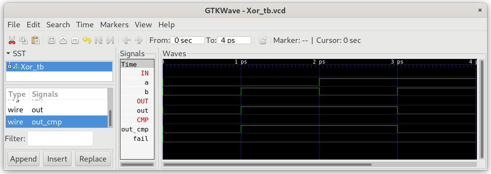

# 01 Boolean Logic

The hardware part of the project nand2tetris-fpga is implemented in verilog, a hardware description language similar to HDL used in the original nand2tetris course. There is no need to learn much verilog, as you can easily translate all your HDL-files into verilog following the given example for `Xor`.

**Note:**
The following modules are considered primitive and thus there is no need to implement them.

| module     | description                                                           |
| ---------- | --------------------------------------------------------------------- |
| `Nand.v`   | Nand-gate. Basic building block for combinatorial logic               |
| `DFF.v`    | Data Flip Flop. Basic building block for sequential logic             |
| `RAM256.v` | uses Block Ram (BRAM) of iCE40                                        |
| `ROM.v`    | uses Block Ram (BRAM) of iCE40 preloaded with HACK-code at startup    |
| `InOut.v`  | Tristate buffer, used to connect to the bidirectional databus of SRAM |

***

## Example Xor

### Xor.hdl

Yout implementation of Xor in HDL (nand2tetris) should look something like:

```
// This file is part of www.nand2tetris.org
// and the book "The Elements of Computing Systems"
// by Nisan and Schocken, MIT Press.
// File name: projects/01/Xor.hdl

/** 
* Xor (exclusive or) gate:
* If a<>b out=1 else out=0.
*/

CHIP Xor {
    IN a, b;
    OUT out;

    PARTS:
    Not(in=a, out=nota);
    Not(in=b, out=notb);
    And(a=a, b=notb, out=w1);
    And(a=nota, b=b, out=w2);
    Or(a=w1, b=w2, out=out);
}
```

### Xor.v

`Xor.hdl` can easily be translated into `Xor.v` (verilog):

```
/** 
* Xor (exclusive or) gate:
* If a<>b out=1 else out=0.
*/

module Xor(
    input a,
    input b,
    output out
);
    wire nota;        //new wire must be declared (as wire)
    wire notb;
    Not NOT1(.in(a), .out(nota));    //Every chip has an instance name (NOT1)
    Not NOT2(.in(b), .out(notb));    //this chip is named NOT2

    wire w1;
    wire w2;
    And AND1(.a(a),.b(notb),.out(w1));
    And AND2(.a(nota),.b(b),.out(w2));

    Or OR(.a(w1),.b(w2),.out(out));
}
```

### Simulation

For every chip wie provide a test folder e.g. `05_Xor`, in which you find a so called testbench (`Xor_tb.v`). To run the test bench cd into the test directory and run apio:

```
$ cd 05_Xor
$ apio clean        (used to remove older implementation from cache)
$ apio sim
```

**Attention:** All used chips used in the verilog code must be already implemented and included in the `Include.v` file.

The test bench will produce a graphical represantation `Xor.gtkw` of all signal lines, which can be viewed with gtkwave.



You can see four sections:

* `IN`: the input signals (generated by the test bench)
* `OUT`: the output signals (generated by YOUR chip implementation)
* `CMP`: the output signals (generated by the test bench)
* `Test`:  the fail signal. Goes high, when the test fails.

Your chip passes the test, when `out=out_cmp` and `fail=0` over the whole test time.

### iCE40HX1K.pcf

To upload the chip `Xor` onto your fpga board iCE40HX1K-EVB you need two additional files: `top.v` and  `iCE40HX1K.pcf` (physical constraints file). The pyhiscal constraints file assigns every io-signal wire of the top level module `top.v` to physical pins of the fpga chip iCE40HX1K. Pin numbering can be checked by consulting the schematic [iCE40HX1K-EVB](../doc/iCE40HX1K-EVB_Rev_B.pdf) in `doc/iCE40HX1K-EVB_Rev_B.pdf`.

```
#  physical constrain file
# assign io-pins to pin numbering of iCE40-HX1K on olimex board iCE40-HX1K-EVB
# compare to the schematic of the board and the datasheet of fpga

set_io BUT1 41    # BUT1
set_io BUT2 42    # BUT2

set_io LED1 40    # LED1
set_io LED2 51    # LED2
```

* Now you can build and upload  the chip `Xor` to iCE40-HX1K-EVB with:
  
  ```
  $ apio clean
  $ apio build
  $ apio upload
  ```

* Press buttons BUT1 and BUT2 and see the result of your `Xor` chip on LED1.

**Attention:** Due to pull up resistors at the buttons, the signals appear inverted:

| pin    | function                                          |
| ------ | ------------------------------------------------- |
| LED1/2 | 0 led is off, 1 led is on                         |
| BUT1/2 | 0 button is pressed down, 1 button is released up |

Chips with note more than two in- and output signals can be uploaded and tested in real hardware: `Nand`, `Not`, `Buffer`, `And`, `Or`, `Xor` and `DMux`.