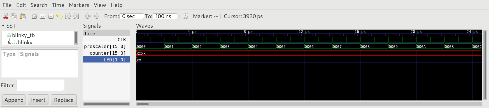
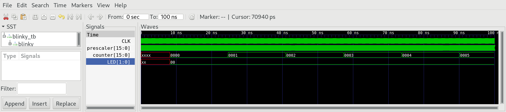

# 03 Sequential Logic

Build sequential chips `Bit` , `Register` and `PC`, that make use of the data flip flop (DFF) to store the state. `DFF` is considered primitive, so it's not necessary to implement it. The memory chips `RAM512` and `RAM3840` are based on the primitive `RAM256`, which uses block ram structures integrated in iCE40HX1K. `BitShift9R` and `BitShift8L` are new chips not explained in the original nand2tetris course. They serve to connect HACK to different IO-Devices, which are connected using a serial protocol, where data is transmitted bitwise.


## blinky

The folder `08_blinky` contains a project to test the counter `PC` in real hardware. Blinky uses counters `PC` to scale down the frequency of 100MHz provided by the clock oscillator on iCE40HX1K-EVB and finally drives the LED1/2.

***

### Project

* Implement the chips `Bit`, `Register`, `PC`, `RAM512`, `RAM3840`,  `BitShift9R` and  `BitShift8L` using `DFF` as primitive building block.

* Implement the chips `RAM512` and `RAM3840` using `RAM256` as primitive building block.

* for every chip we provide a test bench in the dedicated folder.
  
  ```shell
  $ cd <test folder>
  $ apio clean
  $ apio sim
  ```

* Run blinky in simulation
  
  ```
  $ cd 06_blinky
  $ apio clean
  $ apio sim
  ```

* Zoom in to check the prescaler:
  
  

* Zoom out to check the counter:
  
  

* Upload the project to iCE40HX1K-EVB end test in real hardware:
  
  ```
  $ cd 06_blinky
  $ apio clean
  $ apio upload
  ```

* Look at LED1/2 and see if they blink.