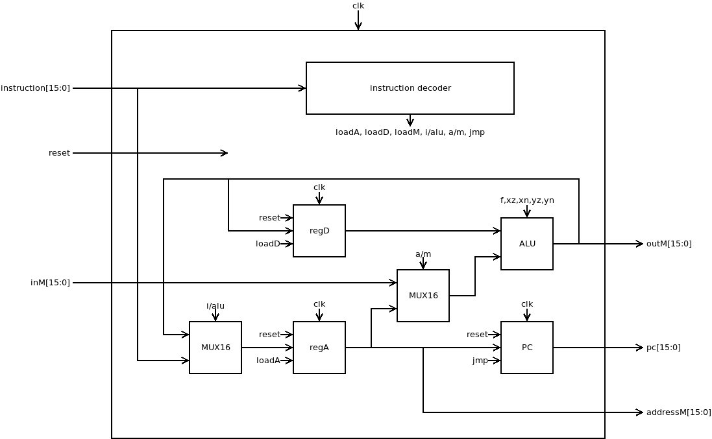
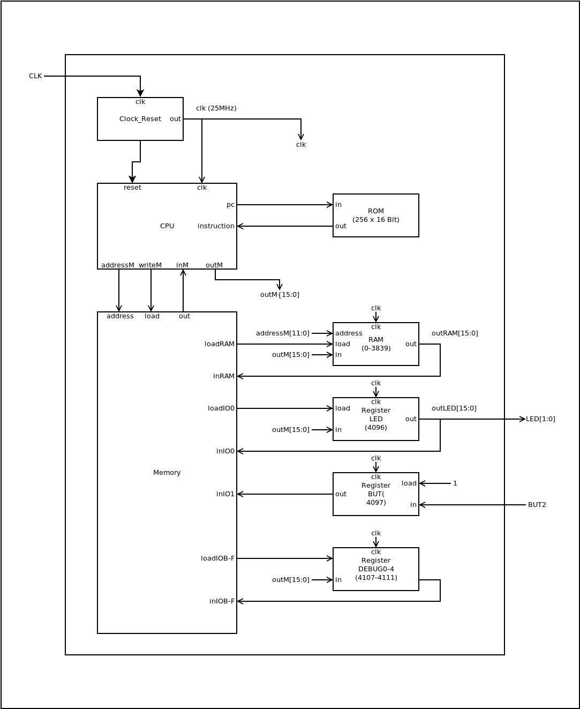
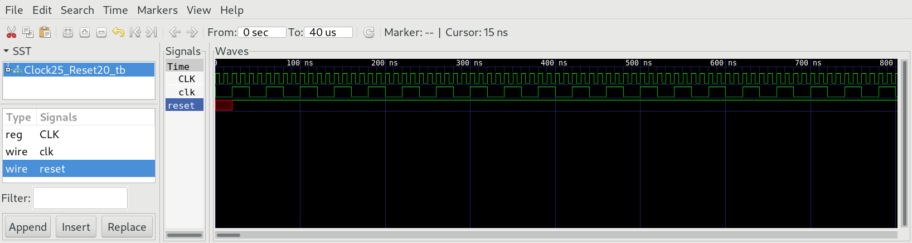
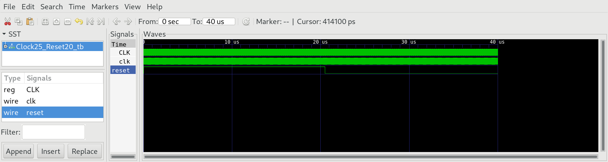
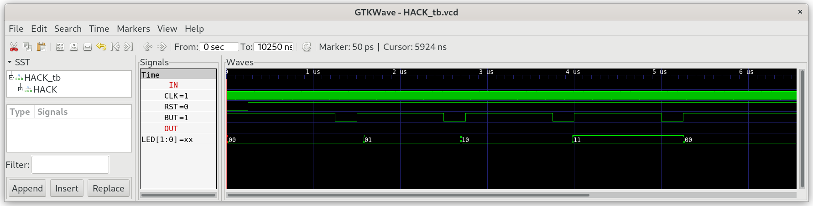
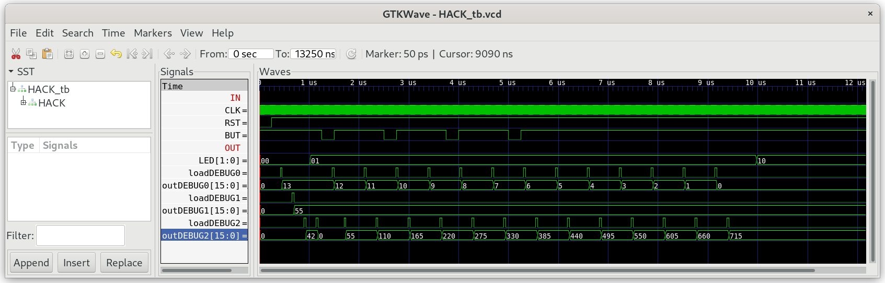

# 05 Computer Architecture

Build the `HACK` computer system consisting of the chips `CPU`, `Memory`, `Clock25_Reset20`, `RAM` and `ROM`. `ROM` uses a block ram structure (256 words) of iCE40HX1K and can be considered primitive. It can be preloaded with the instructions of the assembler programs implemented in `04_Machine_Language` .

### 01 CPU

The `CPU`  corresponds to the proposed implementation of nand2tetris course.

**Attention:** In the original specification of HACK all C instruction have the binary form: 111xxxxxxxxxxxxx and A instruction have the form 0xxxxxxxxxxxxxxx. In order to use HACK with instruction memory ROM >32K (to play tetris), we will also interpret the machine language instructions starting with 000-110 as A-instructions, allowing the following jumps for all labels up to 56K!

```
@label
0;JMP
```

### 02 Memory

The chip `Memory.v`  maps all addresses 0 - 0x0FFF to RAM and the addresses 0x1000-0x100F to the 16 special function registers used for memory mapped IO-Devices and debugging.

### 03 Clock25_Reset20

The 100 MHz (CLK) of the clock generator on the iCE40HX1K-EVB is to fast to drive our HACK design. Therefore we must scale down the external clock (CLK) of 100 MHz to the internal clock (clk) of 25Mhz using a counter `PC` .

HACK CPU needs a reset signal to have a proper start of the complete computer system. The fpga chip nees some time delay to preload the ROM with ROM.hack code. Therefore the reset signal at startup should have a minimal length of approximately 20us.

### 04 HACK

The chip `HACK.v` is the top level module, that connects to the outer world.



The signals wires `CLK`, `RST`, `BUT[1:0]` and `LED[1:0]`  (by convention written in capital letters) connect to the outer pins of the fpga chip iCE40HX1K according to the file `iCE40HX1K.pcf`. The board iCE40-HX1K-EVB comes with a clock generator of 100 MHz, two buttons and two leds connected to FPGA (refer to [datasheets/iCE40HX1K-EVB](../datasheets/iCE40HX1K-EVB_Rev_B.pdf)).

| wire   | iCE40HX1K (FPGA) | board iCE40HX1K-EVB     |
| ------ | ---------------- | ----------------------- |
| CLK    | 15               | 100 Mhz clock generator |
| BUT[0] | 41               | BUT1                    |
| BUT[1] | 42               | BUT2                    |
| LED[0] | 40               | LED1                    |
| LED[1] | 51               | LED2                    |

To add IO capability we add 7 more special function registers mapped to the following addresses:

| address     | I/O dev | function                                             |
| ----------- | ------- | ---------------------------------------------------- |
| 0 - 3839    | RAM     |                                                      |
| 4096        | LED     | 0 = led off, 1 = led on                              |
| 4097        | BUT     | 0 = button pressed "down", 1 = button released       |
| 4098 - 4106 |         | reserved for IO devices (see. project 06_IO_Devices) |
| 4107 - 4111 | DEBUG   | used for debugging                                   |

The HACK simulation needs a valid file `ROM.hack` (created in project `04_Machine_Language`) with the machine language instructions to perform.

The test bench of `04_HACK` will:

1. occasionally press the user buttons BUT1/2
2. show the result of LED1/2
3. show the content of DEBUG0-DEBUG5

***

### Project

- Implement the chips  `CPU` , `Memory` and `Clock25__Reset20` and simulate with the corresponding test benches:
  
  ```
  $ cd 0X_<chipname>
  $ apio clean
  $ apio sim
  ```

- Check the frequency of the internal clk signal to be 25MHz. So one clock cylce takes 40us.
  
  

- Check the reset signal of HACK. You should see a reset signal of approximately 20 us.
  
  
* Implement `HACK` and test with `leds.asm`:
  
  ```
  $ cd ../04_Machine_Language
  $ make leds
  $ cd ../05_Computer_Architecture/04_HACK
  $ apio clean
  $ apio sim
  ```

* Check, if LEDs change state accoring to BUT:
  
  

* Test `HACK` with `mult.asm`.
  
  ```
  $ cd ../04_Machine_Language
  $ make mult
  $ cd ../05_Computer_Architecture/04_HACK
  $ apio clean
  $ apio sim
  ```

* You should see the result 715 of the multiplication 13*55 in the debug register `DEBUG2`! You can change the number format to decimal.

  

* finally upload the complete HACK design with `leds.asm` preloaded into instruction ROM and run in real hardware!
  
  ```
  $ cd ../04_Machine_Language/01_leds
  $ make
  $ cd ../05_Computer_Architecture/04_HACK
  $ apio clean
  $ apio build
  $ apio upload
  ```

* press the user buttons BUT1/BUT2 and see if the LED change pattern accordingly.

* Repeat the test with the second machine language programm `mult.asm`.

**Attention:** remember to run `apio clean`, after changing the file `ROM.hack`! 