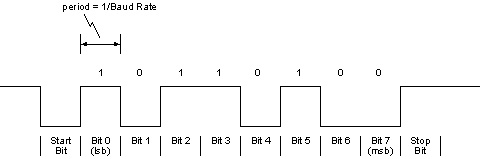
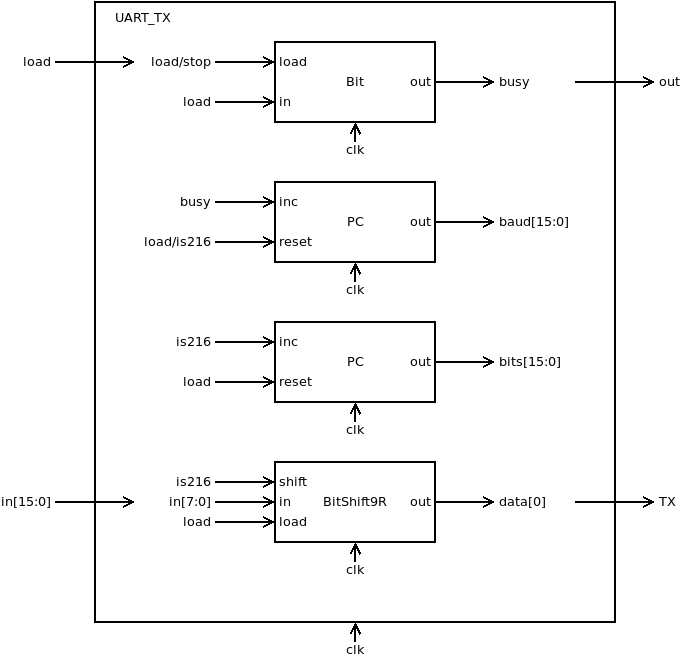
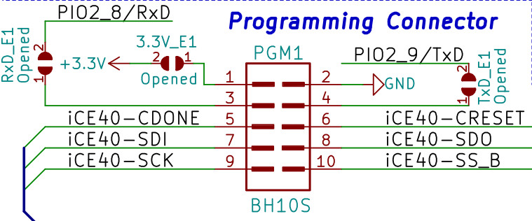
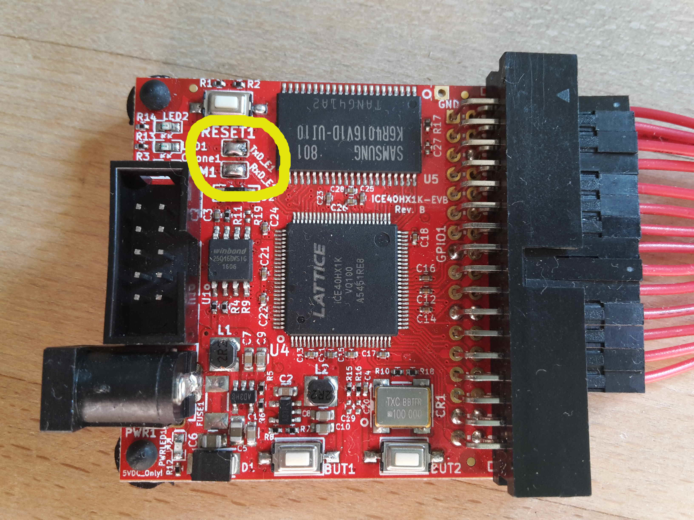
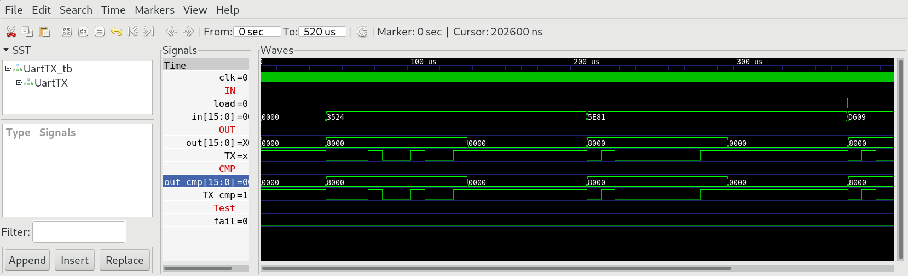
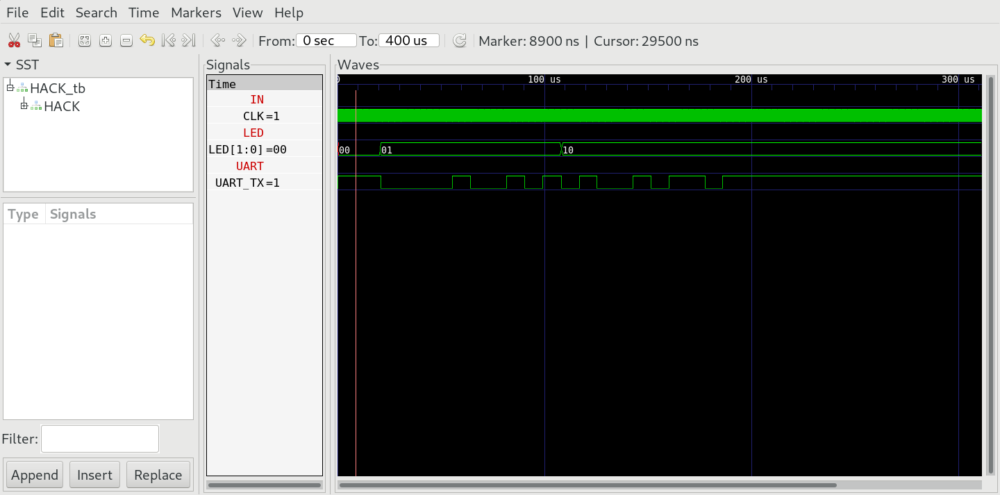

## 01 UartTX

The special function register `UartTX` mapped to memory address 4098 enables HACK to send chars to the outer world over UART with 115200 baud 8N1. The timing diagramm for the TX wire should look like:



During idle TX line is high (logic 1). Transmission of a byte (8 bits) is initiated by the so called start bit, which always is low (logic 0), followed by the 8 data bits, starting with the least significant bit. The transmission is finished by sending the stop bit, which always is high (logic 1).
This protocoll is refered as 8N1 meaning (8 data bits, no parity bit, 1 stop bit). We use a transmission speed of 115200 baud (bits per second), meaning that each bit takes 1s/115200 = 8.68us or 217 cycles of the internal 25MHz clock clk.

### Chip specification

| IN/OUT | wire    | function                                            |
| ------ | ------- | --------------------------------------------------- |
| IN     | in[7:0] | byte to be sent.                                    |
| IN     | load    | =1 initiates the transmission                       |
| OUT    | out[15] | =1 chip is busy, =0 chip is ready to send next byte |
| OUT    | TX      | transmission wire                                   |

When load = 1 the chip starts serial transmission of the byte in[7:0] to the TX line according to the protocoll 8N1 with 115200 baud. During transmission out[15] is set to high (busy). The transmission is finished after 2170 clock cycles (10 byte a 217 cycle each). When transmission completes out[15] goes low again (ready).

### Proposed Implementation

Use a `Bit` to store the state (0 = ready, 1 = busy). Use a counter `PC` to count from 0 to 216. When clocked at 25MHz, this counter will produce the baudrate of 115200 bits per second. A second counter `PC` counts from 0 to 9 (the 10 bits to send). Finally we need a `BitShift9R`. This will be loaded with the bit pattern to be send (startbit, 8 data bits).



### memory map

The special function register `UartTX` is mapped to memory map of HACK according to:

| address | I/O device | R/W | function                              |
| ------- | ---------- | --- | ------------------------------------- |
| 4098    | UART_TX    | R   | out[15]=1 if busy, out[15]=0 if ready |
| 4098    | UART_TX    | W   | send char in[7:0] to TX               |

### hello.asm

To test HACK with `UartTX` we need a little machine language programm `hello.asm`, which sends the String "Hi" to UART.

**Attention:** Use a loop to wait until UartTX is ready to send the next byte.

### UartTX in real hardware

The programmer Olimexino 32u4 can also be used as bridge to connect the PC to iCE40HX1K-EVB over UART. This can be done with the 10 wire UEXT cable which goes into the PGM1 connector of iCE40HX1K-EVB.



**Note:** To connect RX and TX lines of UEXT-connector with iCE40-chip on iCE40-HX1K-EVB find the solder-jumper-pads RxD_E1 and TxD_E1 near the UEXT connector (refer to [datasheets/iCE40HX1K-EVB](../datasheets/iCE40HX1K-EVB_Rev_B.pdf)) and solder them together as in the foto below.



The programmer olimexino 32u4 works in two different mode:

- Mode 1 (yellow led on): programmer of iCE40-board. Used with iceprogduino.
- Mode 2 (green led on): UART Bridge to iCE40 chip. Use with terminal programm (e.g. tio or screen on linux).

To switch between the modes press the hardware button on olimexino 32u4 (HWB).

Now iCE40HX1K is connected to RX,TX of olimexino 32u4 according to `iCE40HX1K-EVB.pcf`. (Check by comparing the schematic of iCE40HX1K-EVB).

```
set_io UART_RX 36    # PIO2_8/RxD connected to pin 3 of UEXT (PGM)
set_io UART_TX 37    # PIO2_9/TxD connected to pin 4 of UEXT (PGM)
```

***

### Project

* Implement `UartTX` and simulate with testbench.
  
  ```
  $ cd 01_UartTX
  $ apio clean
  $ apio sim
  ```

* Compare with CMP:
  
  

* Edit `HACK` and add the special function register `UartTX` to the memory address 4098.

* Implement `hello.asm` and run in simulation:
  
  ```
  $ cd 01_UartTX
  $ make
  $ cd ../00_HACK
  $ apio clean
  $ apio sim
  ```

* Check the TX wire of the simulation and look for the transmission of "Hi".
  
  

* build and upload HACK with `hello.asm` in ROM.BIN to iCE40HX1K-EVB.

* switch olimexino 32u4 to UART-Bridge

* open Terminal on your computer

* press reset button on iCE40HX1K-EVB and see if wou can recieve "Hi" on your Computer.
  
  ```
  $ cd 00_HACK
  $ apio clean
  $ apio upload
  $ tio /dev/ttyACM0
  ```
