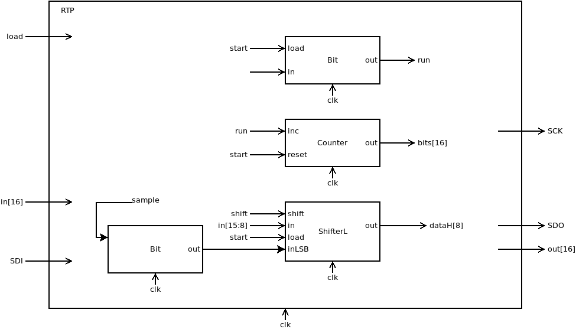
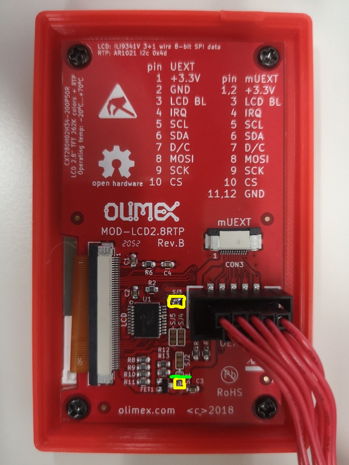
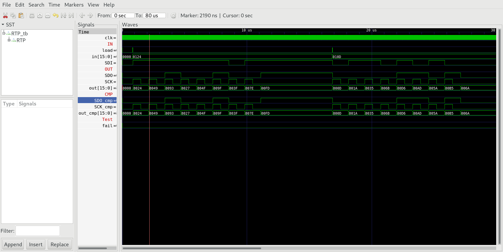

## 07 RTP

The special function register `RTP`  memory mapped to addresses 4106 enables HACK to read bytes from the resistive touch panel controller chip AR1021 situated on MOD-LCD2.8RTP. The communication is protocol is SPI.

**Attention:** The specification of AR1200 requires, that SCK is inverted (compare `03_SPI/Readme.md` with CPOL=1) and a slower transfer rate of max. 900kHz

### Chip specification

| IN/OUT | wire     | function                      |
| ------ | -------- | ----------------------------- |
| IN     | in[7:0]  | byte to be sent.              |
| IN     | load     | =1 initiates the transmission |
| OUT    | out[15]  | =0 chip is busy, =0 ready     |
| OUT    | out[7:0] | received byte                 |
| IN     | SDI      | serial data in                |
| OUT    | SDO      | serial data out               |
| OUT    | SCK      | serial clock                  |

When load=1 transmission of byte in[7:0] is initiated. The byte is send to SDO bitwise together with 8 clock signals on SCK. At the same time `RTP` receives a byte at SDI. During transmission out[15] is 1. The transmission of a byte takes 256 clock cycles (32 cycles for each bit to achieve a slower transfer rate). Every 32 clock cycles one bit is shifted out. In the middle of each bit at counter number 31 the bit SDI is sampled. When transmission is completed out[15]=0 and `RTP` outputs the received byte to out[7:0].

### Proposed Implementation

Use a `Bit` to store the state (0 = ready, 1 = busy) which is output to out[15]. Use a counter `PC` that counts from 0 to 511. Finally we need a `BitShift8L`. It will be loaded with the byte in[7:0] to be send.  Use a `Bit` to sample the SDI line. After 8 bits are transmitted/received `RTP` cleares out[15] and outputs the received byte to in[7:0].

**Attention:** sample on rising edge of SCK and shift on falling edge of SCK.



### Memory map

The special function register `RTP` is mapped to memory map of HACK according to:

| address | I/O device | R/W | function                                                    |
| ------- | ---------- | --- | ----------------------------------------------------------- |
| 4106    | LCD        | W   | start transmittion of byte in[7:0]                          |
| 4106    | LCD        | R   | out[15]=1 busy, out[15]=0 idle, out[7:0] last received byte |

### RTP in real hardware

The board MOD-LCD2.8RTP comes with a resistive touch panel controlled by a controller chip AR1021. MOD-LCD2.8RTP must be connected to iCE40HX1K-EVB with 3 more jumper wire cables according to `iCE40HX1K-EVB.pcf` (Compare with schematic [iCE40HX1K_EVB](../../doc/iCE40HX1K-EVB_Rev_B.pdf) and [MOD-LCD2.8RTP_RevB.pdf](../../doc/MOD-LCD2.8RTP_RevB.pdf).

```
set_io RTP_SDI 7        # PIO3_3A connected to pin 13 of GPIO1
set_io RTP_SDO 8        # PIO3_3B connected to pin 15 of GPIO1
set_io RTP_SCK 9        # PIO3_5A connected to pin 17 of GPIO1
```

| wire    | iCE40HX1K-EVB (GPIO1) | MOD-LCD2.8RTP (UEXT)               |
| ------- | --------------------- | ---------------------------------- |
| +3.3V   | 3                     | +3.3V                              |
| GND     | 4                     | 2 GND                              |
| LCD_DCX | 5                     | 7 D/C                              |
| LCD_SDO | 7                     | 8 MOSI                             |
| LCD_SCK | 9                     | 9 SCK                              |
| LCD_CSX | 11                    | 10 CS                              |
| RTP_SDI | 13                    | 4 IRQ/SDO (with solder jumper SJ3) |
| RTP_SDO | 15                    | 6 SDA                              |
| RTP_SCK | 17                    | 5 SCL                              |

**Attention:** To enable SPI communication on the RTP controller chip AR1021 we must modify two solder jumpers. (Compare with schematic of MOD-LCD2.8RTP together with Datasheet of AR1021).

1. Cut connection SJ1-GND with a sharp cutter knife. (green)

2. Connect SJ1 to +3.3V to activate SPI mode of AR1021 (yellow)

3. Connect SJ3 (UEXT pin4 with SDO) (yellow)



***

### Project

* Implement special function register `RTP` and test with testbench:
  
  ```
  $ cd 07_RTP
  $ apio clean
  $ apio sim
  ```

* Compare output `OUT` of special chip`RTP` with `CMP`.
  
  

* Add special function register`RTP` to `HACK` at memory addresses 4106 and upload to iCE40HX1K-EVB with bootloader boot.asm preloaded into ROM.
  
  ```
  $ cd ../05_GO
  $ make
  $ cd ../00_HACK
  $ apio clean
  $ apio upload
  ```

* Proceed to `07_Operating_System` and implement the driver class `Touch.jack` that sends command over `RTP` the controller chip AR1021 on MOD-LCD2.8RTP
