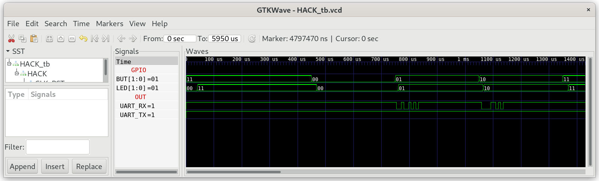

## GPIO.jack

This library provides access to `BUT` and `LED`.

### GPIO-Test

In the Testfolder `01_GPIO_Test` you find a minimal version of `Sys.jack` containing the init function `Sys.init()`, which is called after starting JACK-OS. `Sys.init()` is the JACK-OS version of `leds.asm`, which reads the BUT and writes the values to LED in an endless loop:

```
class Sys {

    function void init() {
        do GPIO.init(4096);
        while (true){
            do GPIO.writeLed(GPIO.readBut());
        }        
        return;
    }
}
```

***

### Project

* Implement `GPIO.jack`

* Test in simulation:
  
  ```
  $ cd 01_GPIO_Test
  $ make
  $ cd ../00_HACK
  $ apio clean
  $ apio sim
  ```
  
  The test bench will simulate the pushing of BUT1/2. Check if the LED change accordingly.
  
  

* run in real hardware with HACK build at `06_IO_Devices/05_GO` (together with the bootloader). Build and upload GPIO_Test to iCE40HX1K-EVB with: 
  
  ```
  $ cd 01_GPIO_Test
  $ make
  $ make upload
  ```

* push buttons BUT on iCE40HX1K-EVB and check the LED.