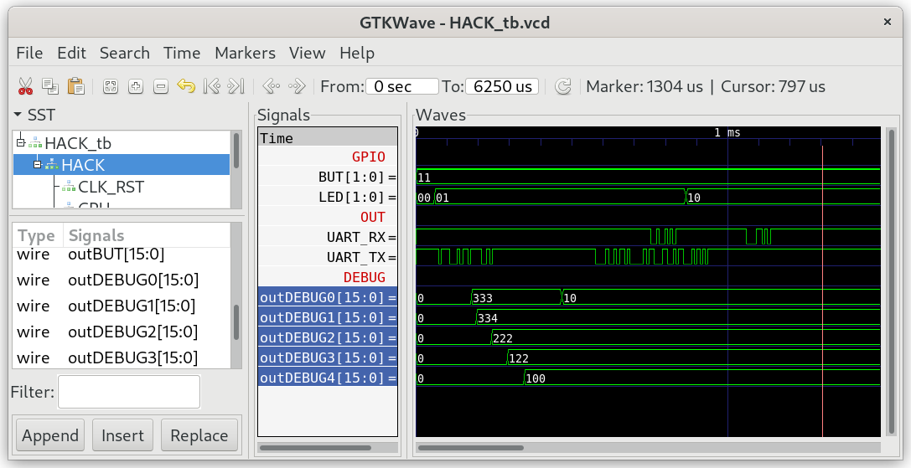

## Memory.jack

This library provides two services: direct access to the computer's main memory (RAM), and allocation and recycling of memory blocks. The Hack RAM consists of  3840 words, each holding a 16-bit binary number.

Don't be afraid of the limited memory size of "only" 3840 words. Let the heap start at address 1024 with `do Memory.init(1024,3839)` in the Sys.init(). This will leave 768 words of stack, which is surely enough to run tetris.

| addr      | segment                       |
| --------- | ----------------------------- |
| 0-15      | R0-R15 (SP,LCL,ARG,THIS,THAT) |
| 16-255    | static                        |
| 256-1023  | stack                         |
| 1024-3839 | heap                          |
| 4096-4111 | IO-devices                    |

***

### Project

* Implement `Memory.jack`

* Test in simulation:
  
  ```
  $ cd 04_Memory_Test
  $ make
  $ cd ../00_HACK
  $ apio clean
  $ apio sim
  ```

* Check the content of special function register DEBUG0--DEBUG4.
  
  
