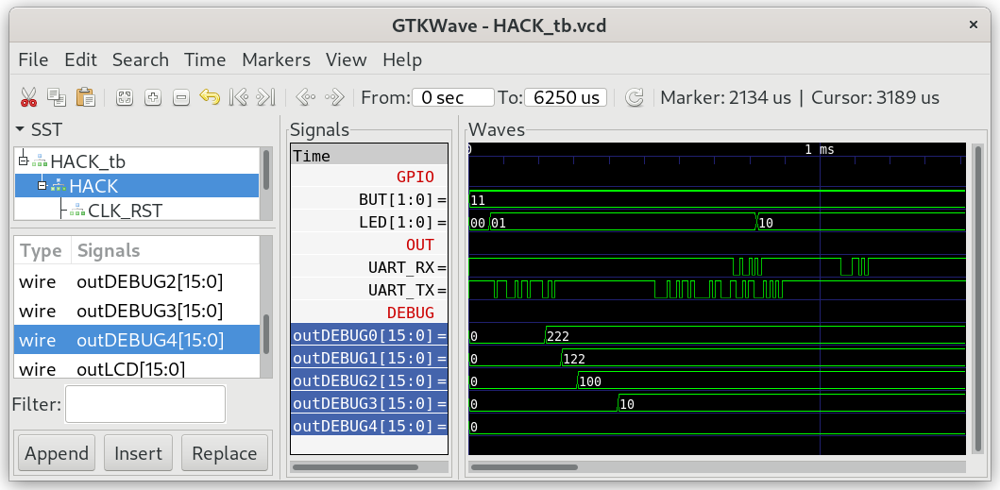

## Array.jack

Represents an array.
In the Jack language, arrays are instances of the Array class. Once declared, the array entries can be accessed using the usual syntax arr[i]. Each array entry can hold a primitive data type as well as any object type. Different array entries can have different data types.

***

### Project

* Implement `Array.jack`

* Test in simulation:
  
  ```
  $ cd 05_Array_Test
  $ make
  $ cd ../00_HACK
  $ apio clean
  $ apio sim
  ```

* Check the content of special function register DEBUG0--DEBUG4.
  
  
