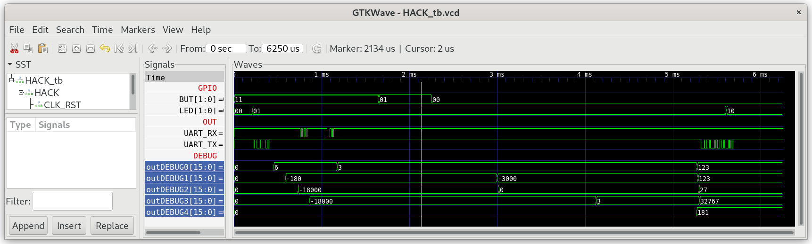

## Math_Test

A library of commonly used mathematical functions.

**Note:** Jack compilers implement multiplication and division using OS method calls.

***

### Project

* Implement `Math.jack`

* Test in simulation:
  
  ```
  $ cd 00_Math_Test
  $ make
  $ cd ../00_HACK
  $ apio clean
  $ apio sim
  ```

* Compare the content of special function register DEBUG0--DEBUG4.
  
