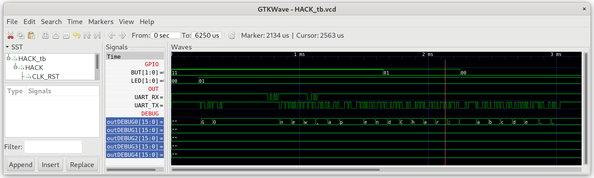

## String.jack

Represents character strings. In addition for constructing and disposing strings, the class features methods for getting and setting individual characters of the string, for erasing the string's last character, for appending a character to the string's end, and more typical string-oriented operations.

***

### Project

* Implement `String.jack` and at least the function `StdIO.printString(String s)`

* Test by running `String_Test`, which performs several String operation and outputs them to StdIO (UART)
  
  **Hint:** Use the debug register to show which caracters are transmitted over `UartTX`. Add the following code in function UART.writeChar():
  
  ```
  do Memory.Poke(4107,data)
  ```
  
  

* Run String_Test in real hardware on iCE40HX1K-EVB using a terminal program connected to UART.

* Compare your terminal output with:
  
  ```
  new,appendChar: abcde
  setInt: 12345
  setInt: -32767
  length: 5
  charAt[2]: 99
  setCharAt(2,'-'): ab-de
  eraseLastChar: abcd
  intValue: 456
  intValue: -32123
  backSpace: 129
  doubleQuote: 34
  newLine: 128
  ```