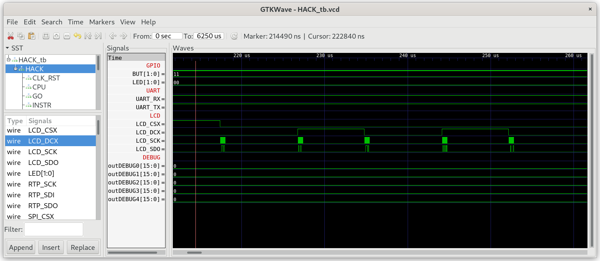
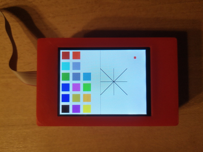

## Screen.jack

A library of functions for displaying graphics on the screen.
The connected LCD physical screen consists of 320 rows (indexed 0..319, top to bottom) of 240 pixels each (indexed 0..239, left to right). The top left pixel on the screen is indexed (0,0). Every pixel can be set to a 16 bit color code composed of RGB-parts of 5 bit red, 6 bit green and 5 bit blue: `rrrrrggggggbbbbb`.

### Special function register LCD

The Screen is controlled by sending commands to special function register LCD, which connects to the ILI9341V controller on MOD-LCD2.8RTP. Every command is 8bit long with DCX=0 pulled low followed by any number (also none) of arguments, which are send with DCX=1 pushed high. All commands are described in the datasheet of [ILI9341V](../../doc/ILI9341V_v1.0.pdf). (h denote hexadecimal and d denote decimal notation).

1. **Memory access control (36h)**: send 54d (DCX=0) followed by the argument 72d (with DCX=1) to get access to the memory of ILI9341V.
2. **COLMOD Pixel Format Set (3Ah)**: send 58d (DCX=0) followed by the argument 85d (DCX=1) to set the pixel format to rgb 16 bit.
3. **Sleep Out (11h)**: send 17d (DCX=0) and wait 500 ms to awake ILI9341V from sleep mode.
4. **Display ON (29h)**: send 41d (DCX=0) and wait 500 ms to switch the display on.

After initialisation with commands 1.-4., the screen turns on showing a random pattern of RGB colors. To paint something on the screen, we must send the following three commands to LCD.

5. **Colum addres set (2Ah)**: To set the x-range of the window into which to paint, send command 42d with DCX=0 followed by x1 (16 bit) and x2 (16 bit) with DCX=1. x1 and x2 must be in the range [0:239] with x2>=x1.
6. **Page address set (2Bh):** To set the y-range of the window into which to paint, send 43d with DCX=0 followed by value of y1 (16 bit) and value of y2 (16 bit) with DCX=1. y1 and y2 must be in the range [0:319] with y2>=y1.
7. **Memory write (2Ch):** To paint the pixel in the rectangle defined by (x1,y1)-(x2,y2) send 44d with DCX=0 followed by `w*h` 16 bit RGB values (DCX=1) of every individual pixel in the rectangle starting at top left and ending at bottom right.

For convenience the commands 1.-7. are distributed to three functions of Screen.jack:

### function void init(int addr)

Initializes the LCD screen, by sending the commands 1.-4. to LCD. The LCD is memory mapped to the two memory addresses addr and addr+1 according to `06_IO_Devices/08_LCD`.

### function void setWindow(int x1,int y1, int x2, int y2)

Sets a rectangle window by sending commands 4.,5. and the command 7. without the arguments. (x1,y1) is the upper left corner and (x2,y2) is the lower right corner of the rectangle window. The next `w*h` calls of writeData16(int value) will paint the pixels in the rectangle according to the rgb values starting in the upper left corner and ending in the lower right corner.

### function void writeData16(int color)

Sends a 16 bit RGB value to paint the next pixel in the window defined by `setWindow(int,int,int,int)`. This procedure must be called `w*h` times to paint every pixel in the rectangle defined by `setAddrWindow(int,int,int,int)`.

***

### Project

* implement `Screen.jack`

* Test in simulation
  
  ```
  $ cd 09_Screen_Test
  $ make
  $ cd ../00_HACK
  $ apio clean
  $ apio sim
  ```
  
  

* Check for the correct init sequence:
  
  * CSX is low starting from the first command.
  * DCX is low while sending commands and high while sending data
  * SDO shows the serial binary representation of the send command/data
  * SCK shows 8 clocks cycles

* Run Screen_Test in real hardware on iCE40HX1K-EVB with MOD-LCD2.8RTP connected as described in `06_IO_Devices/LCD`.
  
  ```
  $ cd 09_Screen_Test
  $ make
  $ make upload
  ```

* Compare the pattern on the LCD with the following picture:
  
  