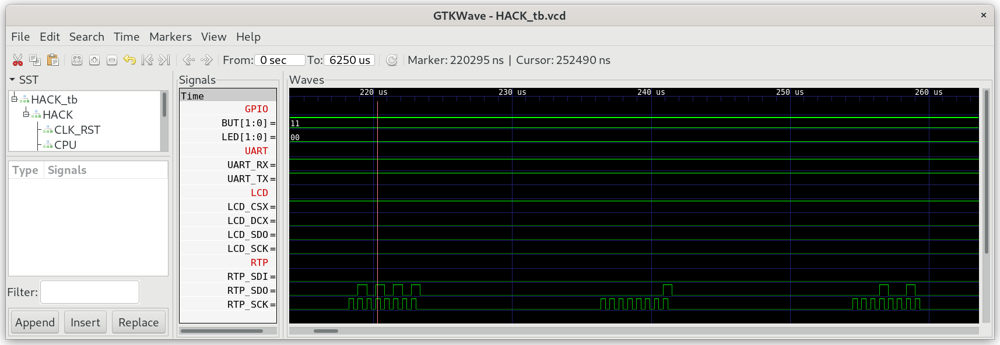

## Touch.jack

A library to read touch events from the resistive touch panel controller AR1021.

See datasheet [AR1021](../../doc/AR1000.pdf):

To read the next touch event just read 5 consecutive bytes from RTP:
pen,xlow,xhigh,ylow and yhigh. Between every byte there should be a delay of min. 50us. When no data is available, the controller will answer with 4Dh (77d). The Event is only valid if the first byte is 128 or 129, and the x and y coordinates are in the range [0..4095].

1. **pen**: 128 = pen up, 129 = pen down
2. **xlow**; 7 least significant bits of x coordinate
3. **xhigh**; 5 most significant bits of x coordinate
4. **ylow**; 7 least significant bits of y coordinate
5. **yhigh**; 5 most significant bits of y coordinate

xhigh[4:0]*128+xlow[6:0] represent a 12 bit x-coordinate in the range 0-4095.

yhigh[4:0]*128+ylow[6:0] represent a 12 bit y-coordinate in the range 0-4095


***

### Project

* implement `Touch.jack`

* Test in simulation
  
  ```
  $ cd 11_Touch_Test
  $ make
  $ cd ../00_HACK
  $ apio clean
  $ apio sim
  ```
  
  

* Check for the inter byte delay of approximately 50us.

* SDO is low while reading data from RTP

* SCK shows 5 blocks of 8 clocks cycles

* Connect the resitive touch panel controller AR1021 of MOD-LCD2.8RTP to iCE40HX1K-EVB as described in `06_IO_Devices/07_RTP` 

* Run Touch_Test in real hardware on iCE40HX1K-EVB. Create some touch events on the resistive touch panel RTP and check the messages send to UART_TX.
  
  ```
  $ cd 11_Touch_Test
  $ make
  $ make upload
  $ tio /dev/ttyACM0
  ```