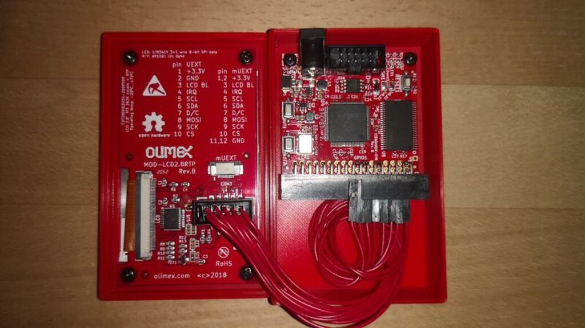
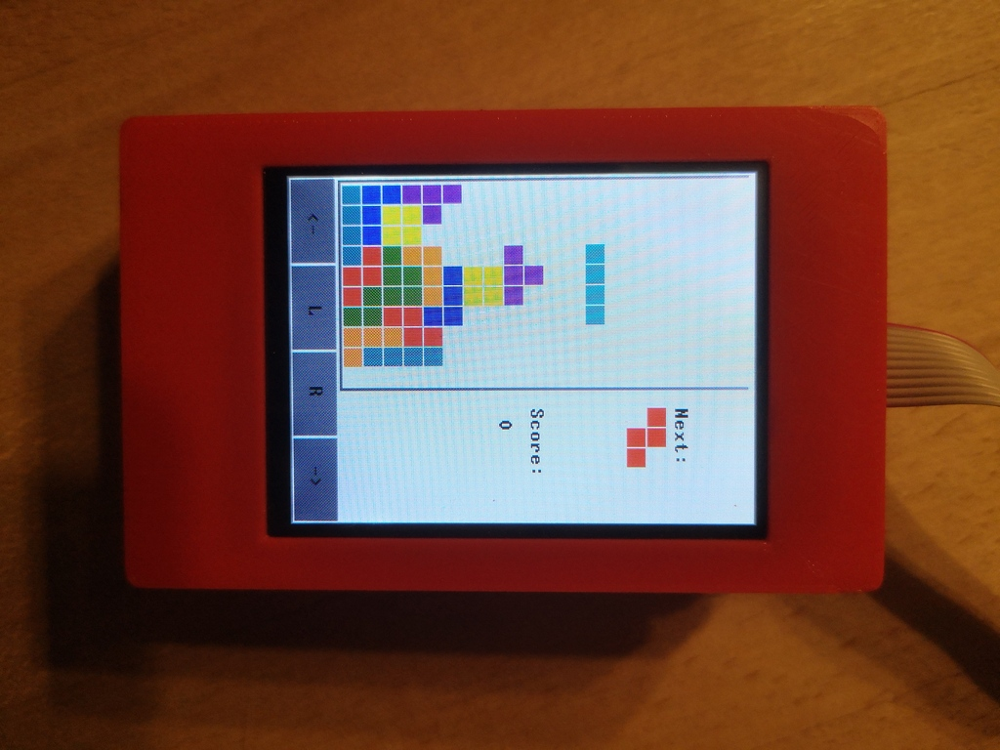

# nand2tetris-FPGA (v2.0)

> ... _Would'nt it be nice to make Hack or Jack also run on some "real platform," made from some "real stuff"?_ ... 
> 
> ---Noam Nisan and Shimon Schocken

This project is about building HACK on real hardware as proposed in Chapter 13 of the course [nand2tetris](https://www.nand2tetris.org/) using only FOSS, free and open source hard- and software.

 

Our final implementation of HACK will have the following specs:

* original CPU/ALU design of HACK from nand2tetris

* implemented on iCE40HX1K-EVB from Olimex

* clocked at 25 MHz 

* RAM 3840 x 16 bit (R0-R15/static/stack/heap)

* SRAM 64K x 16 bit (instruction memory)

* bootloader boots HACK-code from SPI-Flash into SRAM

* 2.8 inch color LCD with 320x240 pixel

* touch-panel support

* powerfull enough to run Tetris!
  
  

***

## Roadmap

In every project folder you find a file `Readme.md` containing specifications and implementation details.

> _... This is your last chance. After this, there is no turning back. You take the blue pill — the story ends, you wake up in your bed and believe whatever you want to believe. You take the red pill — you stay in Wonderland and I show you how deep the rabbit-hole goes. ..._
> 
> ---Morpheus

### [00 Requirement](00_Requirement)

Get the hardware and install the tools.

### [01 Boolean Logic](01_Boolean_Logic)

Start with a simple `Nand` gate and build the logic chips: `Not`, `Buffer`, `And`, `Or`, `Xor`, `Mux`, `DMux`, and theire multibit versions `Not16`, `Buffer16`, `And16`, `Or16`, `Mux16`, `Or8Way`, `Mux4Way16`, `Mux8Way16`, `DMux4Way` and `DMux8Way`.

### [02 Boolean Arithmetic](02_Boolean_Arithmetic)

Proceed and build `HalfAdder`, `FullAdder`, `Add16`, `Inc16` and the `ALU`.

### [03 Sequential Logic](03_Sequential_Logic)

Build sequential chips `Bit` , `Register` and `PC`, that make use of the data flip flop (DFF) to store the state. `DFF` is considered primitive, so it's not necessary to implement it. The memory chips `RAM512` and `RAM3840` are based on the primitive `RAM256`, which uses block ram structures integrated in iCE40HX1K. `BitShift9R` and `BitShift8L` are new chips not explained in the original nand2tetris course. They serve to connect HACK to different IO-Devices, which are connected using a serial protocol, where data is transmitted bitwise.

### [04 Machine Language](04_Machine_Language)

Write two little machine language programms to run on HACK. The first programm `leds.asm` will test I/O capability of HACK. Every time the user presses the buttons BUT1/2 on the iCE40HX1K-EVB board  the LEDs will change accordingly. With the second programm `mult.asm` we will calculate the product of two numbers to test the arithmetic capabilities of the CPU/ALU.

### [05 Computer Architecture](05_Computer_Architecture)

Build `HACK` computer system consisting of the chips `CPU`, `Memory`, `Clock25_Reset20`, `RAM` and `ROM`. `ROM` uses a block ram structure (256 words) of iCE40HX1K and can be considered primitive. It can be preloaded with the instructions of the assembler programs implemented in `04_Machine_Language` .

### [06 IO Devices](06_IO_Devices)

We will expand HACK computer platform by adding chips to handle communication to I/O devices, which we connect to HACK.

* UART communicates with 115200 baud 8N1 to computer
* SPI reads the 2MByte flash memory on iCE40HX1K-EVB
* SRAM writes data to the external SRAM chip
* GO enables booting JACK-OS software
* LCD connects a little color screen with 320x240 pixel
* RTP connects the resistive touch panel

### [07 Operating System](07_Operating_System)

Implement the operating system JACK-OS, written in the high level language JACK consisting of the classes `GPIO.jack`, `UART.jack`, `Memory.jack`, `Math.jack`, `Array.jack`, `String.jack`, `Screen.jack`, `Output.jack`, `Touch.jack` and `Sys.jack`

Finally you can compile and run Tetris!

### [08 3D Printer](08_3D_Printer)

We provide construction files to print a little case for your HACK computer with a 3D-Printer. The case is designed with FOSS software blender.

## Credits

* Noam Nisan and Shimon Schocken, "The Elements of Computing Systems", MIT Press

* Noam Nisan and Shimon Schocken: Visit [nand2tetris](https://nand2tetris.org) and learn to build a modern general-purpose computer system from ground up.

* [Olimex Ltd](https://www.olimex.com/): Buy your hardware from the Company with highest number of registered OSHW projects :)

* Wolf Clifford: The master of open source FPGA with iCE40 and  [Project IceStorm](http://www.clifford.at/icestorm/)

* Jesús Arroyo Torrens, Juan González (Obijuan): Open source ecosystem for open FPGA boards [APIO](https://github.com/FPGAwars/apio)

* Juan González-Gomez (Obijuan): Lern verilog with [open-fpga-verilog-tutorial](https://github.com/Obijuan/open-fpga-verilog-tutorial/), best tutorial!

* Icons made by <a href="https://www.flaticon.com/free-icon/cpu_483131?term=cpu&page=3&position=86" title="Those Icons">Those Icons</a> from <a href="https://www.flaticon.com/" title="Flaticon"> www.flaticon.com</a>

---

For questions or comments write an email to 
mi.schroeder@netcologne.de
